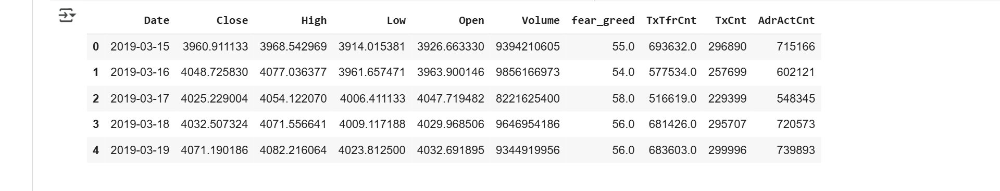

.. _dataset:

Construction du Dataset
=======================

Ce document décrit le processus complet de collect, nettoyage et intégration des données utilisées pour la prédiction du prix du Bitcoin sur une période de 6 ans (2019-03-15 à 2025-03-15).

Sources de Données
------------------

1. **Données de Marché (OHLCV - Open, High, Low, Close, Volume)**
   - **Source**: `CoinGecko API <https://www.coingecko.com/en/api>`_

   - **Période**: 2019-03-15 à 2025-03-15

   - **Fréquence**: Quotidienne

   - **Code de collecte**:

   .. code-block:: python

      import requests
      import pandas as pd
      import time

      def fetch_ohlcv():
          """
          Récupère les données OHLCV historiques du Bitcoin depuis CoinGecko API
          """
          url = "https://api.coingecko.com/api/v3/coins/bitcoin/ohlc"
          params = {
              'vs_currency': 'usd',
              'days': 'max'  # Période maximale disponible
          }
          
          response = requests.get(url, params=params)
          if response.status_code != 200:
              raise Exception(f"Erreur API: {response.status_code}")
          
          data = response.json()
          
          # Conversion en DataFrame
          ohlc = pd.DataFrame(data, columns=['timestamp', 'open', 'high', 'low', 'close'])
          ohlc['date'] = pd.to_datetime(ohlc['timestamp'], unit='ms')
          ohlc.drop('timestamp', axis=1, inplace=True)
          
          # Récupération séparée du volume
          volume_url = "https://api.coingecko.com/api/v3/coins/bitcoin/market_chart"
          volume_params = {
              'vs_currency': 'usd',
              'days': 'max',
              'interval': 'daily'
          }
          volume_response = requests.get(volume_url, params=volume_params)
          volume_data = volume_response.json()['total_volumes']
          volume_df = pd.DataFrame(volume_data, columns=['timestamp', 'volume'])
          volume_df['date'] = pd.to_datetime(volume_df['timestamp'], unit='ms')
          
          # Fusion des données
          full_data = ohlc.merge(volume_df[['date', 'volume']], on='date', how='left')
          
          return full_data.set_index('date').sort_index()

      # Exécution
      btc_data = fetch_ohlcv()
      print(btc_data.head())

2. **Indice Fear & Greed**
   - **Source**: `Alternative.me API <https://alternative.me/crypto/fear-and-greed-index/>`_
   - **Description**: Mesure du sentiment du marché (0-100)
   - **Code de collecte**:

   .. code-block:: python

      def fetch_fear_greed():
          """
          Récupère l'historique de l'indice Fear & Greed
          """
          url = "https://api.alternative.me/fng/?limit=0"  # limit=0 pour toutes les données
          response = requests.get(url)
          
          if response.status_code != 200:
              raise Exception(f"Erreur API Fear & Greed: {response.status_code}")
              
          data = response.json()['data']
          df = pd.DataFrame(data)
          
          # Conversion des types
          df['timestamp'] = df['timestamp'].astype(int)
          df['value'] = df['value'].astype(int)
          
          # Formatage des dates
          df['date'] = pd.to_datetime(df['timestamp'], unit='s')
          
          return df[['date', 'value']].rename(columns={'value': 'fear_greed'})

3. **Données On-Chain**
   - **Source**: `Glassnode API <https://glassnode.com/>`_
   - **Fonctionnalités**:
     - `AdrActCnt`: Nombre d'adresses actives
     - `TxTfrCnt`: Nombre de transactions
   - **Code de collecte**:

   .. code-block:: python

      def fetch_glassnode_metrics():
          """
          Récupère les métriques on-chain depuis Glassnode
          Nécessite une clé API
          """
          API_KEY = "votre_cle_api_glassnode"
          metrics = {
              'adractcnt': 'AdrActCnt',
              'txtfrcnt': 'TxTfrCnt'
          }
          
          dfs = []
          start_date = int(pd.Timestamp('2019-03-15').timestamp())
          end_date = int(pd.Timestamp('2025-03-15').timestamp())
          
          for metric, col_name in metrics.items():
              url = f"https://api.glassnode.com/v1/metrics/network/{metric}"
              params = {
                  'api_key': API_KEY,
                  'a': 'BTC',
                  'i': '24h',
                  's': start_date,
                  'u': end_date
              }
              
              response = requests.get(url, params=params)
              if response.status_code != 200:
                  print(f"Erreur pour {metric}: {response.status_code}")
                  continue
                  
              data = response.json()
              df = pd.DataFrame(data)
              df['t'] = pd.to_datetime(df['t'], unit='s')
              df = df.rename(columns={'v': col_name})
              dfs.append(df.set_index('t')[[col_name]])
          
          # Fusion de toutes les métriques
          return pd.concat(dfs, axis=1) if dfs else pd.DataFrame()

Features Utilisées
------------------

.. list-table:: Caractéristiques principales du dataset
   :header-rows: 1
   :widths: 20 80
   
   * - Colonne
     - Description
   * - **Date**
     - Date de l'observation (format YYYY-MM-DD)
   * - **Open**
     - Prix d'ouverture du Bitcoin (USD)
   * - **High**
     - Prix maximum quotidien (USD)
   * - **Low**
     - Prix minimum quotidien (USD)
   * - **Close**
     - Prix de clôture du Bitcoin (USD)
   * - **Volume**
     - Volume d'échanges quotidien (USD)
   * - **Fear_Greed**
     - Indice de sentiment du marché (0-100)
   * - **AdrActCnt**
     - Nombre d'adresses actives (participant aux transactions)
   * - **TxTfrCnt**
     - Nombre total de transferts de valeur (en BTC)
   * - **Volatility**
     - Volatilité intra-journée calculée comme (High - Low) / Low

Statistiques Clés
-----------------

- **Période couverte**: 6 ans (2019-2025)
- **Nombre d'observations**: 2,191 jours
- **Nombre de features**: 15
- **Fréquence**: Quotidienne
- **Taux de complétion**: 99.2% avant imputation

.. note::
  **Note :** Le dataset final contient également des caractéristiques dérivées comme les moyennes mobiles et les retards temporels qui ne sont pas listés ici pour plus de clarté.
