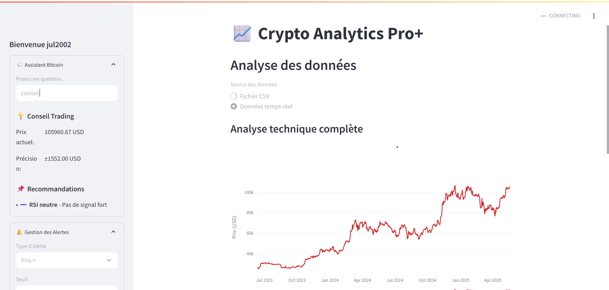
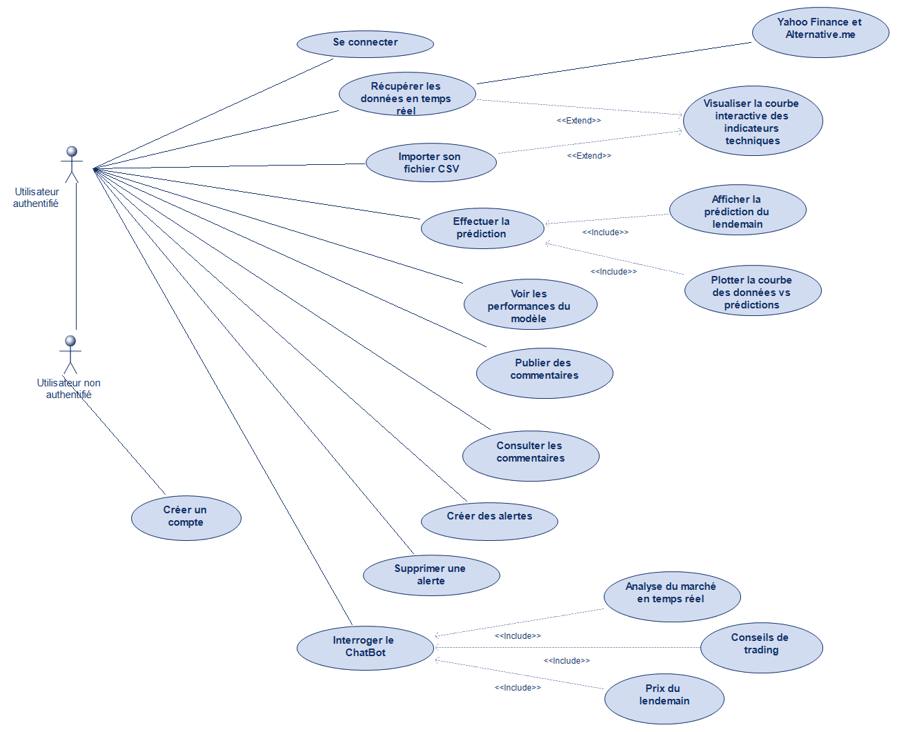

.. _streamlit:

#####################
Interface Streamlit
#####################

CryptoAnalyticsPro
==================

Cette application web interactive offre une suite complète d'outils pour l'analyse et la prédiction du prix du Bitcoin, intégrant:

1. Système d'authentification sécurisé
2. Utilisation données en temps  réel
3. Calcul des indicateurs techniques
4. Importation de son dataset CSV
5. Prédiction du prix du lendemain
6. Assistant trading intelligent
7. Système d'alertes personnalisées
8. Espace communautaire collaboratif

Fonctionnalités Détailées avec Code
===================================

1. Authentification Utilisateur
^^^^^^^^^^^^^^^^^^^^^^^^^^^^^^^

Système complet de création de compte et connexion avec base SQLite.

.. code-block:: python
   :linenos:

   # Initialisation BDD
   conn = sqlite3.connect('users.db')
   c = conn.cursor()
   c.execute('''CREATE TABLE IF NOT EXISTS users
                (id INTEGER PRIMARY KEY AUTOINCREMENT,
                 username TEXT UNIQUE,
                 password TEXT)''')
   
   # Fonctions d'authentification
   def create_user(username, password):
       try:
           c.execute('INSERT INTO users (username, password) VALUES (?, ?)', 
                    (username, password))
           conn.commit()
           return True
       except sqlite3.IntegrityError:
           return False
   
   def verify_user(username, password):
       c.execute('SELECT * FROM users WHERE username=? AND password=?', 
                (username, password))
       return c.fetchone() is not None

2. Tableau de Bord Analytique
^^^^^^^^^^^^^^^^^^^^^^^^^^^^^

Visualisation interactive avec Plotly et calculs d'indicateurs techniques.

.. code-block:: python
   :linenos:

   def fetch_real_data():
       btc = yf.Ticker("BTC-USD")
       hist = btc.history(period="2y")
       
       # Fear & Greed Index
       response = requests.get("https://api.alternative.me/fng/?limit=730")
       fng_data = pd.DataFrame(response.json()['data'])
       fng_data['timestamp'] = pd.to_datetime(fng_data['timestamp'], unit='s')
       
       return hist.merge(fng_data, how='left').ffill()

   def plot_close_with_details(data):
       fig = go.Figure()
       fig.add_trace(go.Scatter(
           x=data.index,
           y=data['Close'],
           name='Close',
           line=dict(color='#d62728'),
           hovertemplate="<b>%{x|%d %B %Y}</b> Close: %{y:.2f} USD "
       ))
       fig.update_layout(height=500, xaxis_rangeslider_visible=True)
       return fig

3. Assistant Trading Intelligent
^^^^^^^^^^^^^^^^^^^^^^^^^^^^^^^^^^^

Chatbot avec analyse de marché et conseils automatisés.

.. code-block:: python
   :linenos:

   class BitcoinChatbot:
       def __init__(self, model, processor):
           self.model = model
           self.processor = processor
           self.thresholds = {
               "rsi_buy": 30,
               "rsi_sell": 70,
               "fear_greed_buy": 25,
               "fear_greed_sell": 75
           }
       
       def get_market_data(self):
           btc = yf.Ticker("BTC-USD")
           hist = btc.history(period="7d", interval="1h")
           return {
               "price": hist["Close"].iloc[-1],
               "rsi": self.calculate_rsi(hist["Close"]),
               "fear_greed": self.get_fear_greed_index()
           }
       
       def generate_advice(self):
           data = self.get_market_data()
           advice = []
           if data['rsi'] < self.thresholds['rsi_buy']:
               advice.append("✅ **RSI bas** - Bonne opportunité d'achat")
           if data['fear_greed'] < self.thresholds['fear_greed_buy']:
               advice.append("✅ **Peur extrême** - Signal d'achat")
           return advice
       
       def generate_response(self, query):
           if "prix demain" in query.lower():
               price = self.predict_tomorrow_price()
               return f"Prévision pour demain: ${price:.2f}"
           elif "conseil" in query.lower():
               return "\n".join(self.generate_advice())

4. Prédiction Temps Réel
^^^^^^^^^^^^^^^^^^^^^^^^

Modèle LSTM pour la prédiction des prix avec indicateurs de confiance.

.. code-block:: python
   :linenos:

   class CryptoDataProcessor:
       def __init__(self):
           self.scaler = RobustScaler()
           self.target_idx = 0
       
       def fit_transform(self, data):
           return self.scaler.fit_transform(data)
       
       def inverse_transform(self, scaled_data):
           return self.scaler.inverse_transform(scaled_data)[:, self.target_idx]
   
   def predict_next_day(model, processor, data):
       scaled = processor.transform(data)
       sequence = scaled[-SEQ_LENGTH:]
       prediction = model.predict(np.array([sequence]))
       return processor.inverse_transform(prediction)[0]

5. Système d'Alertes Personnalisées
^^^^^^^^^^^^^^^^^^^^^^^^^^^^^^^^^^^

Création et gestion d'alertes basées sur des conditions de marché.

.. code-block:: python
   :linenos:

   # Table BDD
   c.execute('''CREATE TABLE IF NOT EXISTS alerts
                (id INTEGER PRIMARY KEY AUTOINCREMENT,
                 user_id INTEGER,
                 condition TEXT,
                 value REAL,
                 created_at DATETIME)''')
   
   # Interface utilisateur
   condition = st.selectbox("Condition", ["Prix >", "Prix <", "RSI >", "RSI <"])
   value = st.number_input("Valeur seuil")
   if st.button("Créer alerte"):
       c.execute('''INSERT INTO alerts (user_id, condition, value, created_at)
                    VALUES (?, ?, ?, ?)''',
                 (user_id, condition, value, datetime.now()))
   
   # Vérification des alertes
   alerts = c.execute('''SELECT condition, value FROM alerts
                         WHERE user_id = ?''', (user_id,)).fetchall()
   for cond, val in alerts:
       st.sidebar.info(f"Alerte: {cond} {val}")

6. Espace Communautaire
^^^^^^^^^^^^^^^^^^^^^^^

Système de commentaires et interactions entre utilisateurs.

.. code-block:: python
   :linenos:

   # Table BDD
   c.execute('''CREATE TABLE IF NOT EXISTS comments
                (id INTEGER PRIMARY KEY AUTOINCREMENT,
                 username TEXT,
                 comment TEXT,
                 timestamp DATETIME)''')
   
   # Publication
   comment = st.text_area("Votre commentaire")
   if st.button("Publier"):
       c.execute('''INSERT INTO comments (username, comment, timestamp)
                    VALUES (?, ?, ?)''',
                 (username, comment, datetime.now()))
   
   # Affichage
   comments = c.execute('''SELECT username, comment, timestamp 
                           FROM comments ORDER BY timestamp DESC''').fetchall()
   for user, cmt, time in comments:
       st.markdown(f"**{user}** - {time.strftime('%d/%m/%Y %H:%M')}: {cmt}")

7. Analyse Technique Avancée
^^^^^^^^^^^^^^^^^^^^^^^^^^^^
Calcul et visualisation des indicateurs techniques.

.. code-block:: python
   :linenos:

   def calculate_rsi(prices, period=14):
       delta = prices.diff().dropna()
       gain = delta.where(delta > 0, 0)
       loss = -delta.where(delta < 0, 0)
       
       avg_gain = gain.rolling(period).mean()
       avg_loss = loss.rolling(period).mean()
       
       rs = avg_gain / avg_loss
       return 100 - (100 / (1 + rs))
   
   def calculate_macd(prices, slow=26, fast=12):
       ema_slow = prices.ewm(span=slow).mean()
       ema_fast = prices.ewm(span=fast).mean()
       return ema_fast - ema_slow

Architecture principale 
^^^^^^^^^^^^^^^^^^^^^^^

