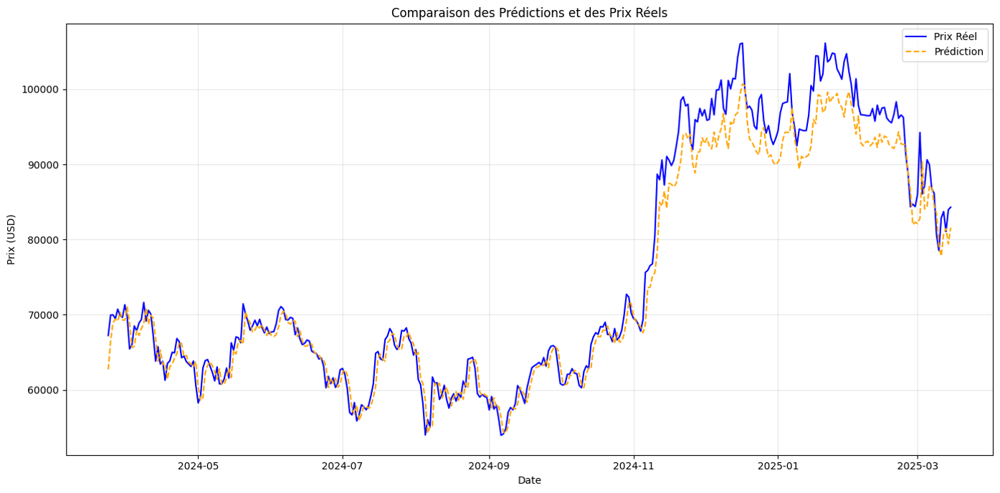

.. _resultats-section:

Résultats
=========

Cette section présente les résultats détaillés du modèle de prédiction du prix Bitcoin après entraînement et optimisation.

.. contents:: 
   :depth: 2
   :local:

Métriques Clés de Performance
-----------------------------

Les principales métriques d'évaluation sur l'ensemble de test :

+------------------------------+----------+-----------------------------------------+
| Métrique                     | Valeur   | Interprétation                          |
+==============================+==========+=========================================+
| **MAE** (Erreur Absolue      | 1552.32  | Écart moyen absolu entre les            |
| Moyenne)                     |          | prédictions et la réalité               |
+------------------------------+----------+-----------------------------------------+
| **RMSE** (Root Mean Square   | 2371.43  | Mesure des erreurs importantes avec     |
| Error)                       |          | pondération quadratique                 |
+------------------------------+----------+-----------------------------------------+
| **Précision Directionnelle** | 72.3%    | Pourcentage de prédictions correctes    |
|                              |          | de la tendance (hausse/baisse)          |
+------------------------------+----------+-----------------------------------------+

Visualisation des Prédictions
-----------------------------

Comparaison des prix réels et prédits sur la période de test :

   
**Les prédictions (orange) suivent étroitement les prix réels (bleu), particulièrement dans les tendances stables mais a du mal dès que le marché est affecté par des décisions politiques ou des déclarations de personnes influentes d'où la nécessité de rajouter des données encore plus globales.**
